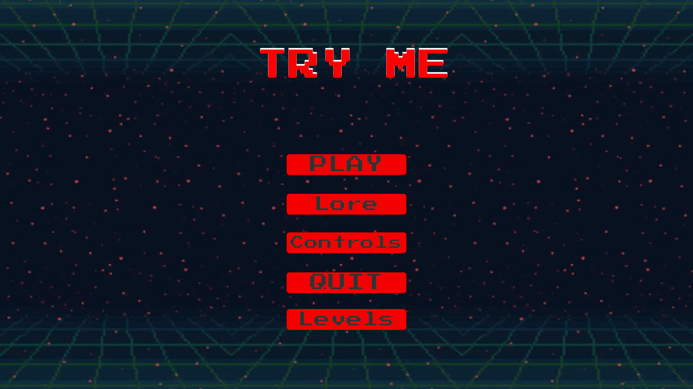
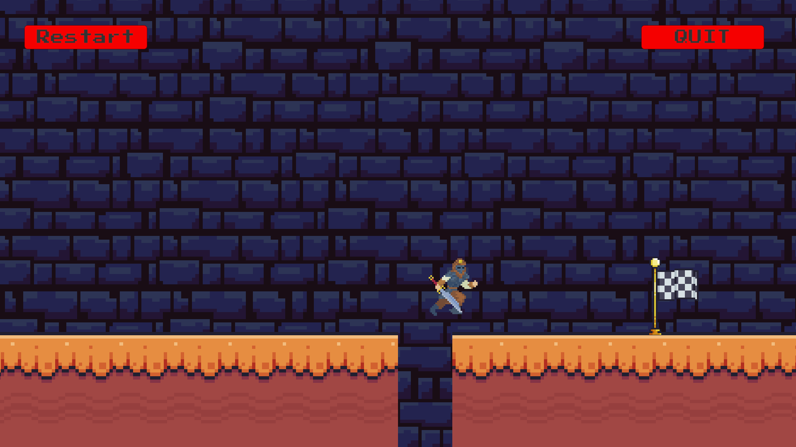
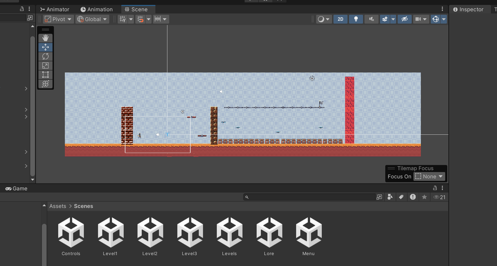
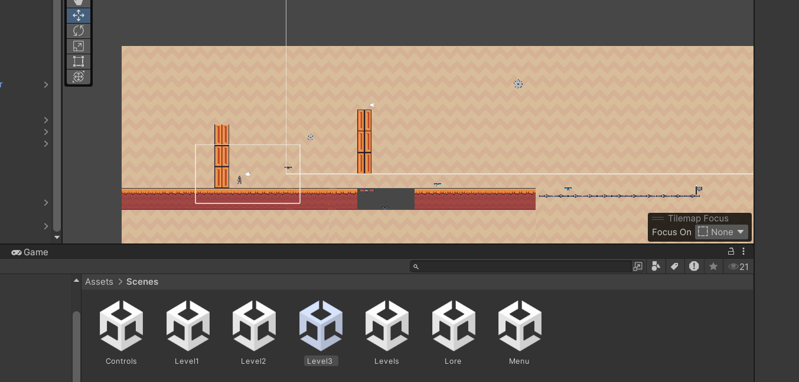
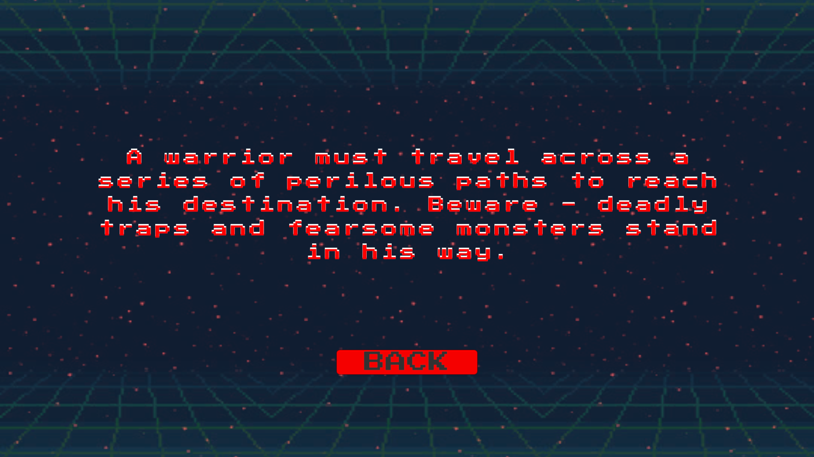

# Try Me 
### Zain Sukhera June 2026

A ragebait platformer, built with **Unity**.

Prepare for unexpected traps, fake-out platforms, and moments designed to test your patience. Every level is meant to keep you guessing, so don't trust what you see!

---

## 🎮 Features

- ⚠️ Hidden traps and unexpected obstacles
- 🧩 5 handcrafted levels
- 🎨 Built using the Unity Engine
---

## 📸 Screenshots

### Main Menu



### Level 1



### Level 2



### Level 3



### Lore




## 🛠️ Built With

- Unity
- C#

---

## 📂 Project Structure

```
Assets/
Packages/
ProjectSettings/
```

---

## 🎯 Objective

Reach the exit of each level while avoiding hidden traps and surviving the game's tricks.

---

## 📜 License

This project is for educational and portfolio purposes.

All original assets and trademarks belong to their respective owners.